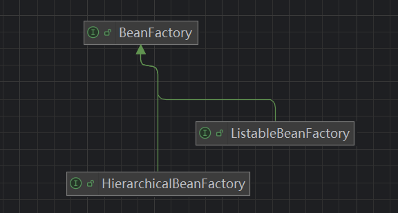

# Spring笔记

Maven引入SpringFrameWork依赖

```html
<dependency>
    <groupId>org.springframework</groupId>
    <artifactId>spring-context</artifactId>
    <version>6.1.14</version>
</dependency>
```


## 程序示例

### xml配置文件

按照spring要求创建配置xml文件

在配置文件中进行对于User实例的创建

id：唯一标识

class：创建对象的全路径

```html
<?xml version="1.0" encoding="UTF-8"?>
<beans xmlns="http://www.springframework.org/schema/beans"
       xmlns:xsi="http://www.w3.org/2001/XMLSchema-instance"
       xsi:schemaLocation="http://www.springframework.org/schema/beans http://www.springframework.org/schema/beans/spring-beans.xsd">
    <bean id="user" class="com.thrinisty.bean.User"/>
</beans>
```


### 通过Spring创建对象

在获取上下文的时候，可以传入多个配置文件，创建使用所有配置文件中的类

```java
package com.thrinisty.test;

import com.thrinisty.bean.User;
import org.junit.jupiter.api.Test;
import org.springframework.context.ApplicationContext;
import org.springframework.context.support.ClassPathXmlApplicationContext;

public class FirstTest {
    @Test
    public void test() {
        //获取Spring容器，其中ApplicationContext是接口，
        //由ClassPathXmlApplicationContext实现从配置文件获取上下文
        ApplicationContext context = new ClassPathXmlApplicationContext("bean.xml");
        //根据id获取bean对象
        User user = (User)(context.getBean("userBean"));
        System.out.println(user);
    }
}
```

通过Spring调用util中的工具类

```html
<bean id="date" class="java.util.Date"/>
```

```java
Date date = (Date) (context.getBean("date"));
//Date date = context.getBean("date", Date.class);
//不需要强制类型转化（传入第二个类对象参数）
System.out.println(date);
```

当没有获取到bean对象（没有对应id）抛出异常

如果bean配置文件不再资源文件夹中，通过 FileSystemXmlApplicationContext 指定路径获取

```java
ApplicationContext context = new FileSystemXmlApplicationContext("d:/temp.xml");
```


#### 继承关系

其中BeanFactory是Spring中的顶级对象，其余的类基本继承这个对象

根据底层代码，可以得出 Spring 的控制反转IoC是通过 XML解析 + 工厂模式 + 反射机制实现的



```java
public interface ApplicationContext extends EnvironmentCapable, ListableBeanFactory, HierarchicalBeanFactory, MessageSource, ApplicationEventPublisher, ResourcePatternResolver
```


#### 细节

在getBean之前，类的构造器方法就已经被执行

```java
ApplicationContext context = new ClassPathXmlApplicationContext("bean.xml","beanNew.xml");
//Person person = context.getBean("person", Person.class);
//System.out.println(person);
```

```
Person constructor
```


## 依赖注入

### set注入

基于set方法，底层通过set方法利用反射完成注入

```java
public interface UserService {
    void saveUser();
}
```

```java
public class UserServiceImpl implements UserService {
    private UserDao userDao;

    @Override
    public void saveUser() {
        System.out.println("Service调用UserDao");
        userDao.insert();
    }

    //set方法
    public void setUserDao(UserDao userDao) {
        this.userDao = userDao;
    }
}
```


```java
public interface UserDao {
    void insert();
}
```

```java
public class UserDaoImpl implements UserDao {
    @Override
    public void insert() {
        System.out.println("数据库保存用户信息");
    }
}
```

通过xml配置管理bean

```html
<?xml version="1.0" encoding="UTF-8"?>
<beans xmlns="http://www.springframework.org/schema/beans"
       xmlns:xsi="http://www.w3.org/2001/XMLSchema-instance"
       xsi:schemaLocation="http://www.springframework.org/schema/beans http://www.springframework.org/schema/beans/spring-beans.xsd">
    <bean id="userDaoBean" class="com.thrinisty.dao.UserDaoImpl"/>
    <bean id="userServiceBean" class="com.thrinisty.service.UserServiceImpl">
        <property name="userDao" ref="userDaoBean"/>
    </bean>
</beans>
```

通过property指定set方法，再指定传入的参数（ref传入BeanID）

如此将service和dao两个对象通过set注入，即可通过service调用dao方法

我们创建一个新的VipDao，我们我们在不修改原先代码的情况下，可以通过xml spring配置文件设置VipDao对象，再通过property标签传入set方法，以及传入的VipBean对象id就可以达到IoC的目的

```html
<bean id="userDaoVip" class="com.thrinisty.dao.UserDaoVip"/>
<bean id="userServiceBean" class="com.thrinisty.service.UserServiceImpl">
    <property name="userDao" ref="userDaoVip"/>
</bean>
```

```java
public class UserDaoVip implements UserDao {
    @Override
    public void insert() {
        System.out.println("数据库保存VIP用户信息");
    }
}
```


### 构造注入

新创建一个继承于UserService接口的类，有一个构造方法，试图通过构造注入两个UserDao接口的实例userDaoImpl与UserDaoVip

```java
public class CustomerService implements UserService{
    private UserDao userDaoImpl;
    private UserDao UserDaoVip;

    public CustomerService(UserDao userDaoImpl, UserDao userDaoVip) {
        this.userDaoImpl = userDaoImpl;
        UserDaoVip = userDaoVip;
    }

    @Override
    public void saveUser() {
        System.out.println("顾客调用Dao");
        userDaoImpl.insert();
        UserDaoVip.insert();
    }
}
```

配置文件

配置两个UserDao的Bean对象

通过constructor-arg传入各个参数，赋值为两个Bean对象

```html
<beans xmlns="http://www.springframework.org/schema/beans"
       xmlns:xsi="http://www.w3.org/2001/XMLSchema-instance"
       xsi:schemaLocation="http://www.springframework.org/schema/beans http://www.springframework.org/schema/beans/spring-beans.xsd">
    <bean id="userDaoBean" class="com.thrinisty.dao.UserDaoImpl"/>
    <bean id="userDaoVip" class="com.thrinisty.dao.UserDaoVip"/>

    <bean id="customerServiceBean" class="com.thrinisty.service.CustomerService">
        <constructor-arg index="0" ref="userDaoBean"/>
        <constructor-arg index="1" ref="userDaoVip"/>
    </bean>
</beans>
```

测试程序

```java
@Test
public void ConstructTest() {
    ApplicationContext context = new ClassPathXmlApplicationContext("beans.xml");
    UserService userService= context.getBean("customerServiceBean", CustomerService.class);
    userService.saveUser();
}
```


## Set注入专题

在实际使用中主要使用Set注入的方式

### 内/外部Bean

```java
public class OrderDao implements UserDao {
    @Override
    public void insert() {
        System.out.println("OrderDao.insert");
    }
}
```

```java
public class OrderService implements UserService {
    UserDao userDao;

    public void setUserDao(UserDao userDao) {
        this.userDao = userDao;
    }

    @Override
    public void saveUser() {
        System.out.println("调用OrderDao");
    }
}
```

```html
<beans xmlns="http://www.springframework.org/schema/beans"
       xmlns:xsi="http://www.w3.org/2001/XMLSchema-instance"
       xsi:schemaLocation="http://www.springframework.org/schema/beans http://www.springframework.org/schema/beans/spring-beans.xsd">
    <bean id="orderDao" class="com.thrinisty.dao.OrderDao"/>
<!--    注入外部bean-->
    <bean id="orderService" class="com.thrinisty.service.OrderService">
        <property name="userDao" ref="orderDao"/>
    </bean>
<!--注入内部Bean-->
    <bean id="orderServiceAnother" class="com.thrinisty.service.OrderService">
        <property name="userDao">
            <bean class="com.thrinisty.dao.OrderDao"/>
        </property>
    </bean>
</beans>
```

```java
@Test
public void OrderDaoTest() {
    ApplicationContext context = new ClassPathXmlApplicationContext("order.xml");
    UserService userService = context.getBean("orderService[Another]", OrderService.class);
    userService.saveUser();
}
```

都可以达到预期的目的


### 注入简单类型

简单类型：八种包装类，Sring类型，枚举类型，日期类，Class类，时间时区类型，Class类型

User对象

```java
public class User {
    private String username;
    private String password;
    private int age;
    //省略各个set方法
}
```

spring配置文件，通过value赋予值

```html
<bean id="user" class="com.thrinisty.bean.User">
    <property name="age" value="18"/>
    <property name="password" value="123456"/>
    <property name="username" value="张三"/>
</bean>
```

测试文件

```java
@Test
public void test() {
    ApplicationContext context = new ClassPathXmlApplicationContext("spring.xml");
    User user = context.getBean("user", User.class);
    System.out.println(user);
}
```


#### 其余的示例

其中日期当作简单类型的时候格式要求严格，一般不以简单格式注入

```html
<bean id="simple" class="com.thrinisty.bean.Simple">
    <property name="age" value="10"/>
    <property name="age2" value="20"/>
    <property name="username" value="username"/>
    <property name="c" value="c"/>
    <property name="c2" value="d"/>
    <property name="flag" value="true"/>
    <property name="flag2" value="false"/>
    <property name="season" value="SPRING"/>
    <property name="clazz" value="java.io.File"/>
    <property name="date" value="Mon May 19 21:28:03 CST 2025"/>
</bean>
```

```java
public class Simple {
    private int age;
    private Integer age2;
    private boolean flag;
    private Boolean flag2;
    private char c;
    private Character c2;
    private Season season;
    private String username;
    private Class clazz;
    private Date date;
    }
```

```java
@Test
public void test2() {
    ApplicationContext context = new ClassPathXmlApplicationContext("spring.xml");
    Simple simple = context.getBean("simple", Simple.class);
    System.out.println(simple);
    //Simple{age=10, age2=20, flag=true, flag2=false, c=c, c2=d, season=SPRING, username='username', clazz=class java.io.File, date=Tue May 20 11:28:03 CST 2025}
}
```

我们之前在学习JDBC配置文件的时候是通过properties配置文件通过Properties类通过键值的方式获取配置信息，而学了SpringSet注入后，我们可以不进行复制，将复制的工作交给Spring通过xml中property注入value完成

:::warning

级联属性赋值是一种机制，可以在被注入的对象中对于诸如的对象参数进行赋值，使用级联属性赋值的时候需要注意以下两点

1. 提供注入对象的get方法
2. 顺序不可以颠倒，要先注入对象，在进行对对象赋值

:::
