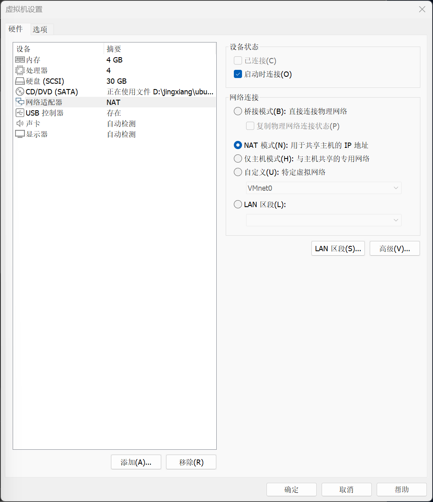
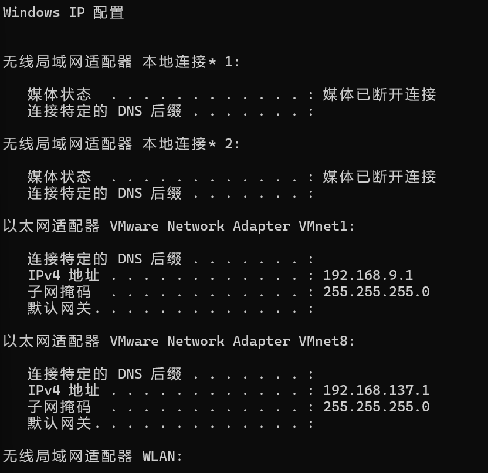
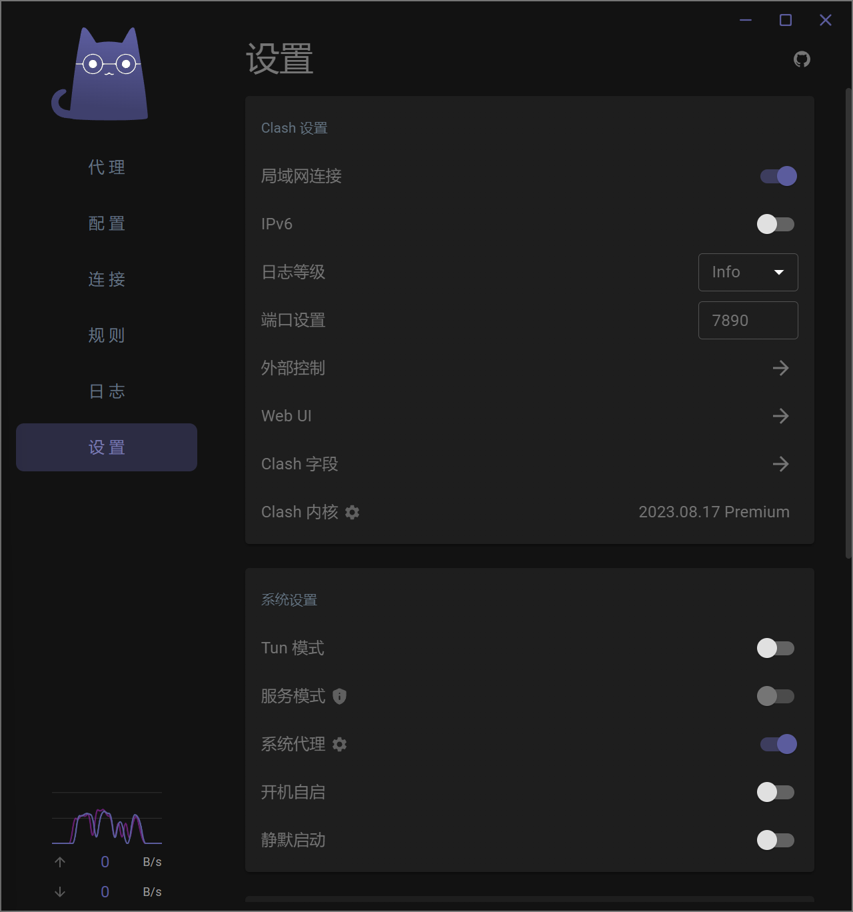
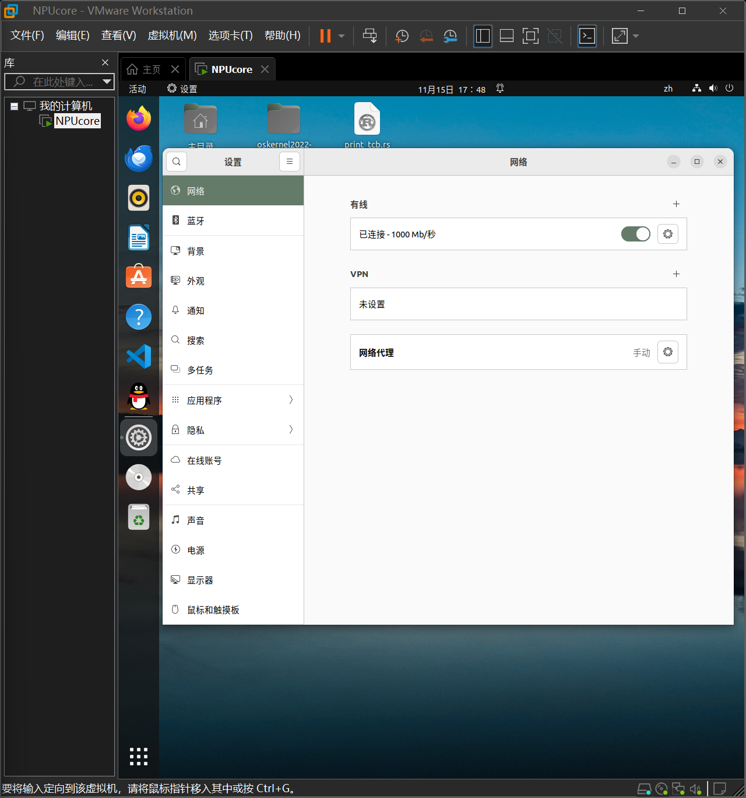
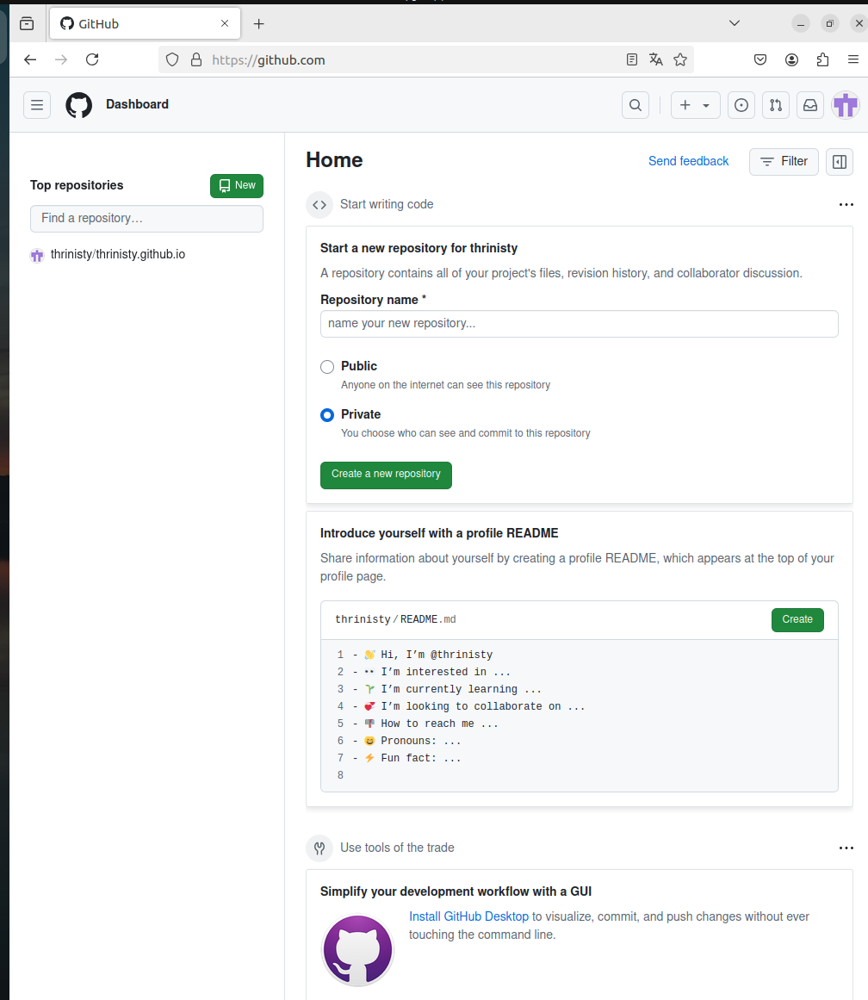

---

title: 虚拟机代理
published: 2024-11-15
updated: 2024-11-15
description: 'VMware虚拟机代理设置，在安装rust软件包时碰到的问题'
image: './photo/vmware.jpg'
tags: [VMware, Clash]
category: ''
draft: false 
---

### 第一份正式的博客内容

这算是我写的第一份博客，大学时光已经过半，我也想在有限的时间里面留下点什么，希望这一篇推文可以帮助到你:happy:

#### 序言

和大多数人一样，我在linux安装各种软件包的时候，想到的第一个方法应该是换源，换一个学术的源平台去下载各种各样的包或者软件之类的，但是有的时候镜像资源难免会出现一些缺漏，导致了没有办法正确的找到依赖，而通过代理的方式可以在linux虚拟机下安装各式各样的软件一劳永逸，接下来是我从网络上找寻到的一种方式

#### 解决方式（需要主机拥有代理软件）

##### 第一种解决方式：用图形化界面手动设置

第一：设置虚拟机（我这里运用的是VMware虚拟机，Ubuntu版本为22.04）



如图我们将其中的网络适配器网络连接方式更改成为NAT桥接模式，使虚拟机与宿主机共享同样的的IP地址

第二：记录主机的IP地址

在主机上打开终端，键入  ipconfig 查看，其中会打印出很多的网络配置信息，我们重点聚焦于主机的IP地址


其中以太网适配器中的IPv4是我们所需的，将其记录下来：192.168.9.1


第三：开启代理软件获取其端口号（以clash举例，多的我也没有）



其中7890就是我们所需要的内容，将其记录下来

第四：启动linux虚拟机设置并开启网络代理

在网络代理设置中点击手动（默认为已禁用），此时不更改网络代理的数据的时候是无法正常上网的



下一步为设置两个代理，以及Socks主机


其中前一个为IP地址：填入主机IP，后一个端口号填入代理端口，保存即可完成虚拟机共享主机代理的设置

第五：验证代理是否成功

发现可以正常访问学术网站，linux虚拟机代理成功，同时也可以解决rustc软件包安装失效的问题



##### 第二种解决方式：通过命令行配置代理

第一：配置代理

在终端中输入以下指令（ip地址为你自己的，端口号为代理软件的，同第一种解决方式中的一样）

```
export https_proxy=http://192.168.9.1:7890
export http_proxy=http://192.168.9.1:7890
export ftp_proxy=http://192.168.9.1:7890
```

第二：配置生效

安装完成后，我们可以重新打开一个终端来让之前设置的环境变量生效。

我们也可以手动将环境变量设置应用到当前终端（非永久生效，仅限于当前终端），输入以下命令：

```
source $HOME/.cargo/env
```

#### 结语

真诚地希望你的问题在这里得到解决，以上是我写的有关linux虚拟机代理的解决方法
