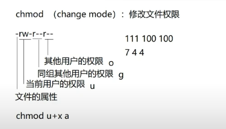

### linux中的一些常用指令

#### cd（change directory）更改目录

其中 / 是linux中的根目录， . 代表的是当前的目录， .. 表示上一层目录
大部分的情况下 ./ 可以省略 直接cd + 目录下的文件路径

cd ||  cd ~进入家目录

cd - 进入上一次的目录

#### ls（list）显示当前目录的文件

-l参数会显示各个类型属性

-a还会显示额外的文件

-al综合前两个

#### cp（copy）拷贝文件

cp + 拷贝源路径 + 目标路径

-r 参数 递归地拷贝

#### mv（move to）剪切

用法与复制类似

特殊用法（更改名字）

mv + 目标原来的文件名 + 现在的文件名

#### chmod （change mode）修改文件权限

可以通过chmod 744 文件名 修改

chmod u+x 文件

chmod g-r  文件

chmod o+r 文件

#### rm（remove）删除文件

-rf 强制删除参数

#### touch 创建文件

touch a b c

#### mkdir 创建文件夹

#### tar 压缩

tar -zcf 压缩名字 需要压缩的文件文件

tar -xzf 解压文件

tar -zcf x.tar.gz a b c

#### find 查找文件

find 路径 -name "文件名"

#### grep 查找关键字

grep "搜索关键字" 路径 -r (递归)

