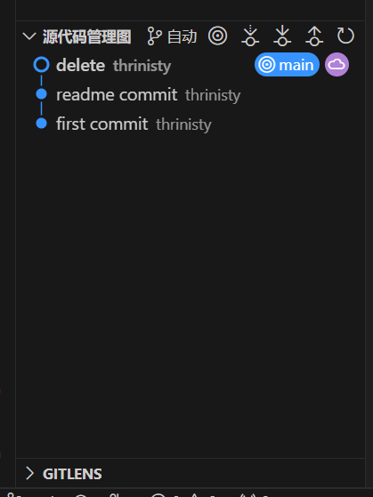
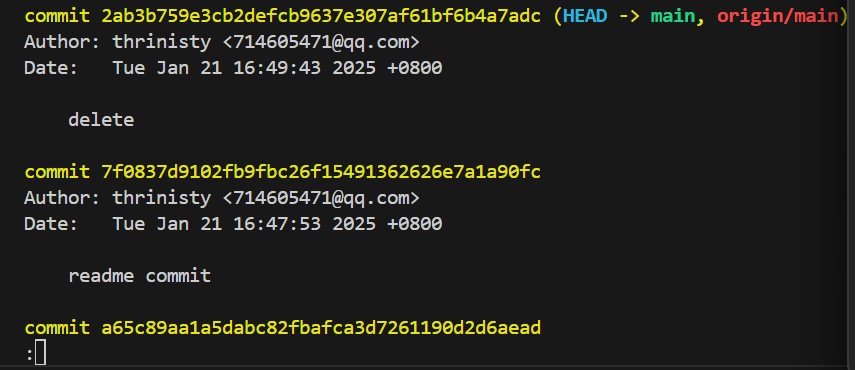

git的功能相当于一个游戏的存档功能，可用以代码的管理，正确使用git即可提高编码的效率以及存储安全，

在VScode之中可以通过GUI进行快速的配置与github的git链接，首先用默认的浏览器注册一个GitHub账号，保持账号的登陆状态，按照网络上的教程安装git（详细可参照各大博客上的相关教程）

再次打开vscode即可在上图的位置看到打开文件夹以及克隆仓库的两个选项，我们选择创建一个文件夹，在文件夹下可以新建一个本地的git仓库，可以自行在仓库中添加一些内容，提交就等价于游戏中保存一个本地存档，而同步相当于提交本地的游戏数据到云端存储，而第一次存储到github中需要按照相关的步骤对本地的环境进行授权操作。

以上是源代码的管理图，有着代码各个版本的说明以及修改内容介绍，蓝色的代表本地存档，而紫色的代表云存档，二者进度不一定相同，例如提交了本地仓库，但是没有同步至云端。

在对应的仓库目录下，我们可以在终端使用git log指令查看日志，来检索git提交的版本信息 ，键入q来进行退出

上述我们通过了在本地的初始化建立git仓库，默认提交到了github中，当然我们也可以在GitHub中先建立仓库，然后再远程建立连接，我们先在源代码管理界面的右侧找到三个点...的选项，选择远程，添加远程库，如果你登陆了github账号的话即可自动查找github中的仓库，选取并在后续选择私有或者公有即可

