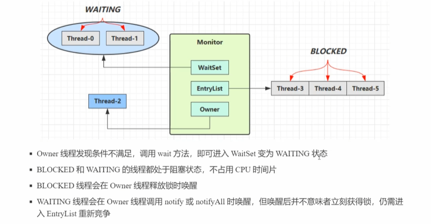

# 多线程并发编程笔记

## 可见性与有序性

JMM 即 Java Memory Model，定义了主存，工作内存抽象概念，底层对应着CPU寄存器，缓存、硬件内存、CPU指令优化等

JMM体现在以下几个方面

1.原子性：保证指令不会受到线程上下文切换的影响

2.可见性：保证指令不会受到CPU缓存影响

3.有序性：保证指令不会受到CPU指令并行优化影响


**可见性**

场景：无限运行不会停止

```java
public class jmm {
    private static boolean run = true;
    public static void main(String[] args) throws InterruptedException {
        Thread t = new Thread(() -> {
            while (run) {

            }
        });
        t.start();
        Thread.sleep(1000);
        run = false;
    }
}
```

这是由于t线程由于频繁度run变量，JMM进行了优化，将run缓存（或者还有可能JIT编译优化为true），后续修改run后run对于t任然是true，因为使用的缓存


解决方式：加上volatile修饰

```java
public class jmm {
    private static volatile boolean run = true;
    public static void main(String[] args) throws InterruptedException {
        Thread t1 = new Thread(() -> {
            while (run) {
                
            }
        });
        t1.start();
        Thread.sleep(1000);
        run = false;
    }
}
```


**有序性**

JVM在不影响正确性的前提下，可以调整语句的执行顺序

```
i=1;
j=2;
```

JVM可以将其调整为，不影响结果

```
j=2;
i=1;
```

指令重排用于优化性能


## volatile

底层原理是内存屏障，Memory Barrier

对于volatile变量的写指令后会加入写屏障

对于volatile变量的读指令后会加入读屏障


写屏障：保证在该屏障之前的时候，对于共享变量的改动，都同步到主存中

读屏障：保证在该屏障之后，对共享变量的读取，加载的是主存中的最新数据




## 无锁并发

使用场景

使用AtomicInteger原子无所实现账户余额扣除

```java
package com;

import java.util.concurrent.atomic.AtomicInteger;

public class CAS {
    public static void main(String[] args) throws InterruptedException {
        Account account = new Account(100);
        Thread t1 = new Thread(() -> {
           for (int i = 0; i < 5; i++) {
               account.withdraw(10);
           }
        });
        t1.start();
        for (int i = 0; i < 5; i++) {
            account.withdraw(10);
        }
        t1.join();
        System.out.println(account.getBalance());
    }
}

class Account {
    private AtomicInteger balance;
    public Account(int balance) {
        this.balance = new AtomicInteger(balance);
    }
    public int getBalance() {
        return balance.get();
    }
    public void withdraw(int amount) {
        while (true) {
            int prev = balance.get();
            int target = prev - amount;
            if(balance.compareAndSet(prev, target)) {
                break;
            }
        }
    }
}
```

其中的关键是compareAndSet，在CPU底层实现原子性


### 原子整数

AtomicInteger

```java
public class Auto {
    public static void main(String[] args) {
        AtomicInteger i = new AtomicInteger(100);
        i.incrementAndGet();//自增并且获取值++i
        i.getAndIncrement();//返回结果再自增i++
        i.addAndGet(10);//自增10再获取
        i.getAndAdd(10);//先获取再加10
    }
}
```

改造一下原先的CAS实现，使用getAndAdd再次封装的类

```java
public void withdraw(int amount) {
    balance.getAndAdd(amount);
}
```

自定义原子操作

```java
public class Auto {
    public static void main(String[] args) {
        AtomicInteger i = new AtomicInteger(100);
        i.updateAndGet(x -> 5 * x);
        System.out.println(i);//500
    }
}
```


### 源自引用

AtomicReference、AtomicMarkableReference、AtomicStampedReference

```java
public class Auto {
    public static void main(String[] args) {
        AtomicAccount balance = new AtomicAccount(new BigDecimal("100.00"));
        balance.withdraw(new BigDecimal("50"));
        System.out.println(balance.getBalance());
    }
}

class AtomicAccount {
    private AtomicReference<BigDecimal> balance;

    public AtomicAccount(BigDecimal balance) {
        this.balance = new AtomicReference<>(balance);
    }
    public BigDecimal getBalance() {
        return balance.get();
    }
    public void withdraw(BigDecimal amount) {
        while (true) {
            BigDecimal prev = balance.get();
            BigDecimal next = prev.subtract(amount);
            if (balance.compareAndSet(prev, next)) {
                break;
            }
        }
    }
}
```


ABA问题：在查询和修改之间如果另外一个线程修改过A，又修改过为B，则对于compareAndSet是没有办法直到其中有没有修改的，在大多数业务是没有问题的，但是主线程没法感知修改，我们要做到这一步需要使用AtomicStampedReference，设置版本号

```java
public class Auto {
    public static void main(String[] args) {
        AtomicAccount balance = new AtomicAccount(new BigDecimal("100.00"));
        balance.withdraw(new BigDecimal("50"));
        System.out.println(balance.getBalance());
    }
}

class AtomicAccount {
    private AtomicStampedReference<BigDecimal> balance;

    public AtomicAccount(BigDecimal balance) {
        this.balance = new AtomicStampedReference<>(balance, 0);
    }
    public BigDecimal getBalance() {
        return balance.getReference();
    }
    public void withdraw(BigDecimal amount) {
        while (true) {
            BigDecimal prev = balance.getReference();
            int stamp = balance.getStamp();
            BigDecimal next = prev.subtract(amount);
            if (balance.compareAndSet(prev, next, stamp, stamp + 1)) {
                break;
            }
        }
    }
}
```


AtomicMarkableReference不关心更改了几次，而是关心是否更改过

```java
class AtomicAccount {
    private AtomicMarkableReference<BigDecimal> balance;

    public AtomicAccount(BigDecimal balance) {
        this.balance = new AtomicMarkableReference<>(balance, false);
    }
    public BigDecimal getBalance() {
        return balance.getReference();
    }
    public void withdraw(BigDecimal amount) {
        while (true) {
            BigDecimal prev = balance.getReference();
            boolean marked = balance.isMarked();
            BigDecimal next = prev.subtract(amount);
            if (balance.compareAndSet(prev, next, marked, true)) {
                break;
            }
        }
    }
}
```


### 原子累加器

LongAdder

可以提升性能，在竞争的时候，设置多个累加单元（Cell），最后再将结果汇总，这样可以有效地减少CAS重试失败的次数


### Unsafe

Unsafe对象提供了非常底层的内存操作，线程，Unsafe对象不可以直接调用，只能通过反射获取，直接使用getUnsafe会报错

```java
Unsafe unsafe = Unsafe.getUnsafe(); // 抛出 java.lang.SecurityException
```

JVM 会检查调用类的类加载器，只有由 **Bootstrap ClassLoader** 加载的类（如 JRE 核心库）才能直接获取 `Unsafe` 实例

```java
@Slf4j
public class Main {
    public static void main(String[] args) throws Exception {
        Field field = Unsafe.class.getDeclaredField("theUnsafe");
        field.setAccessible(true);
        Unsafe unsafe = (Unsafe) field.get(null);
        System.out.println(unsafe);
    }
}
```

```java
@Slf4j
public class Main {
    public static void main(String[] args) throws Exception {
        Field field = Unsafe.class.getDeclaredField("theUnsafe");
        field.setAccessible(true);
        Unsafe unsafe = (Unsafe) field.get(null);
        System.out.println(unsafe);
        long idOffset = unsafe.objectFieldOffset(Teacher.class.getDeclaredField("id"));
        long nameOffset = unsafe.objectFieldOffset(Teacher.class.getDeclaredField("name"));
        Teacher teacher = new Teacher();
        unsafe.compareAndSwapInt(teacher, idOffset, 0, 1);
        unsafe.compareAndSwapObject(teacher, nameOffset, null, "李四");
        System.out.println(teacher);
    }
}

@Data
class Teacher {
    volatile long id;
    volatile String name;
}
```

```
sun.misc.Unsafe@490d6c15
Teacher(id=1, name=李四)
```


## 不可变设计

不可变类使用，不可变类设计，无状态设计

可变发生并发安全问题：

`SimpleDateFormat` 继承自 `DateFormat`，其内部使用了一个 **可变成员变量** `Calendar` 来存储日期解析/格式化的中间状态

```java
SimpleDateFormat sdf = new SimpleDateFormat("yyyy-MM-dd");

Runnable task = () -> {
    try {
        // 多个线程共享同一个 SimpleDateFormat 实例
        System.out.println(sdf.format(new Date()));
    } catch (Exception e) {
        e.printStackTrace();
    }
};

// 启动 10 个线程
for (int i = 0; i < 10; i++) {
    new Thread(task).start();
}

```

- **多线程并发时**，多个线程可能同时修改 `calendar` 的状态，导致数据混乱。

可以用DateTimeFormatter代替，其内部的成员是不可变的

```java
DateTimeFormatter formatter = DateTimeFormatter.ofPattern("yyyy-MM-dd");
```


一个类的不可变设计

要么用final修饰变量，要么是私有的外界不可访问

另外一个就是不让继承，重写方法，实现方法

```java
@Stable
private final byte[] value;
private final byte coder;
private int hash; // Default to 0
```

而因为byte用final修饰只是不可修改引用，我们还需要用保护性拷贝进行对于value内部数据的保护，使其不被修改

