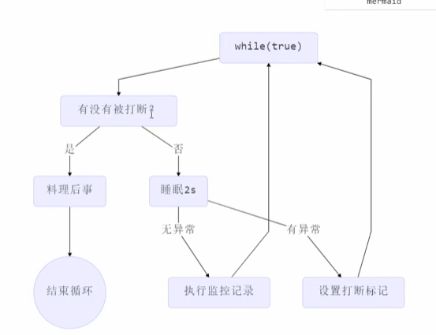

# 多线程并发编程笔记

## 简本概念

**Amdahl定律** S = 1 / (a + (1 - a) / n)

采用并发可以提升的效率


**并发和并行**

并发（Concurrent）：值单核CPU多个程序同时运行，轮流抢占CPU时间片（幻觉自己独占CPU）

并行（Parallel）：多核CPU，在不同核心上一起执行（真正的一起执行）


**线程与进程**

进程是内存分配，资源调度的基本单位，是线程的容器

线程是执行任务的单位，独立子任务，享受进程分配的空间


## 线程使用

从方法调用角度来看，需要等待结果返回才可以继续执行那就是同步

不需要等待结果返回就可以运行是异步

为了后续方便调试我们使用日志框架

```xml
<configuration>
    <!-- 控制台输出 -->
    <appender name="CONSOLE" class="ch.qos.logback.core.ConsoleAppender">
        <encoder>
            <pattern>%d{yyyy-MM-dd HH:mm:ss} [%thread] %-5level %logger{36} - %msg%n</pattern>
        </encoder>
    </appender>

    <!-- 文件输出 -->
    <appender name="FILE" class="ch.qos.logback.core.FileAppender">
        <file>logs/app.log</file>
        <encoder>
            <pattern>%d %level [%thread] %logger{10} - %msg%n</pattern>
        </encoder>
    </appender>

    <!-- 日志级别设置 -->
    <root level="INFO">
        <appender-ref ref="CONSOLE" />
        <appender-ref ref="FILE" />
    </root>

    <!-- 自定义包级别 -->
    <logger name="com.example" level="DEBUG" />
</configuration>
```

导入接口

```xml
<dependency>
    <groupId>org.projectlombok</groupId>
    <artifactId>lombok</artifactId>
    <version>1.18.34</version>
    <scope>provided</scope>
</dependency>
<!-- SLF4J API（必须） -->
<dependency>
    <groupId>org.slf4j</groupId>
    <artifactId>slf4j-api</artifactId>
    <version>2.0.9</version> <!-- 使用最新稳定版 -->
</dependency>

<!-- Logback 实现（经典组合） -->
<dependency>
    <groupId>ch.qos.logback</groupId>
    <artifactId>logback-classic</artifactId>
    <version>1.4.11</version>
</dependency>
```

使用Lambda来简化创建运行线程

```java
@Slf4j
public class Main {
    public static void main(String[] args) {
        Thread thread = new Thread(() -> log.info("创建线程方法执行..."));
        thread.setName("子线程1");
        thread.start();
        log.info("主线程执行...");
    }
}
```

```
2025-10-26 14:31:49 [子线程1] INFO  com.Main - 创建线程方法执行...
2025-10-26 14:31:49 [main] INFO  com.Main - 主线程执行...
```

用Future配合Thread，可以返回结果

```java
@Slf4j
public class Main {
    public static void main(String[] args) throws ExecutionException, InterruptedException {
        FutureTask<Integer> task = new FutureTask<>(() -> {
           log.info("线程01执行...");
           return 100;
        });
        Thread thread = new Thread(task, "thread01");
        thread.start();
        log.info("等待结果返回...");
        Integer integer = task.get();
        log.info("主线程获取参数：" + integer);
    }
}
```

```
2025-10-26 14:40:28 [thread01] INFO  com.Main - 线程01执行...
2025-10-26 14:40:28 [main] INFO  com.Main - 等待结果返回...
2025-10-26 14:40:28 [main] INFO  com.Main - 主线程获取参数：100
```


## 常见方法

start：让线程进入就绪状态

run：线程启动后调用的方法

join：等待线程运行结束

join(long n)：等待线程运行结束，最多等待n毫秒

getId：获取线程长整型id

getName：获取线程名称

setName(String name)：设置线程名

getPriority：获取线程优先级

setPriority(int i)：设置线程优先级

getState()：获取线程状态

isInterrupted：判断是否被打断-不会清除打断标记

isAlive：线程是否存活

interrupt：打断线程

interrupted：判断当前线程是否被打断-会清除打断标记

currentThread：获取当前正在执行的线程

sleep(long n)：让当前执行的线程休眠n毫秒

yield：提示线程调度器让出当前线程

setDaemon(boolean flag)：设置守护线程

LockSupport工具类中的part方法：可以暂停线程，如果需要继续执行通过打断完成，我们后续如果还需要part暂停还需要将打断标记重新设计为假


## 两阶段终止

在一个线程T1种优雅终止T2，给T2一个料理后事的机会



在打断的时候会设置打断标记，注意如果在Sleep中被打断需要再次catch种打断自身，设置打断标记

```java
@Slf4j
public class TwoPhaseTermination {
    private Thread monitor;

    public void start() {
        monitor = new Thread(() -> {
            while (true) {
                log.info("线程方法处理中...");
                Thread current = Thread.currentThread();
                if(current.isInterrupted()) {
                    log.info("后续处理");
                    break;
                }
                try {
                    Thread.sleep(1000);
                } catch (InterruptedException e) {
                    log.info("在睡眠中打断");
                    current.interrupt();
                }
            }
        });
        monitor.start();
    }

    public void stop() {
        monitor.interrupt();
    }
}
```

主程序调用

```java
@Slf4j
public class Main {
    public static void main(String[] args) throws ExecutionException, InterruptedException {
        TwoPhaseTermination twoPhase = new TwoPhaseTermination();
        twoPhase.start();
        Thread.sleep(4000);
        twoPhase.stop();
    }
}
```
