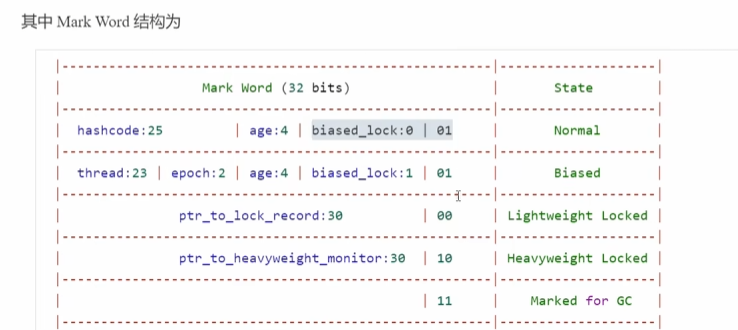
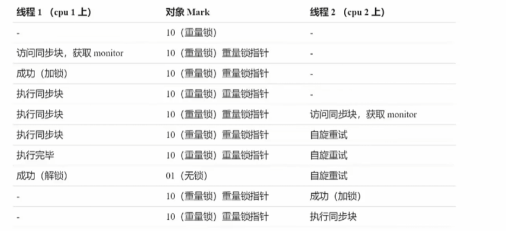

# 多线程并发编程笔记

## 线程安全

成员变量和静态变量是否线程安全

如果没有共享则线程安全，反之还要考虑是否写


局部变量是否线程安全

局部对象是线程安全的，但是如果引用的对象逃离了线程的作用域那么就不是线程安全了


对于一些并发安全的集合，它的方法是原子的，但是如果组合使用方法不保证线程安全，需要保证组合方法业务的原子性


## 对象头

在32为虚拟机上普通类对象头是64位的，包括Mark Word和Klass World（通过这个找到类对象）

数组对象的对象头是96位的在前者基础上添加了array length



**Monitor**

被翻译为监视器或者管程


每个Java对象都可以关联一个Monitor对象，如果使用synchronized给对象上锁（重量级）该对象的Mark Word种就被设置指向Monitor对象指针

如果另一个对象发现需要加锁的对象关联了Monitor，则会去查看是否有主人，如果有则进入阻塞队列BLOCKED，等待拥有者释放锁

当释放锁后EntryList尝试唤醒阻塞队列中阻塞的线程，让唤醒的线程成为Monitor的新主人


## Synchronized进阶

### 轻量级锁

如果一个对象虽然有很多线程访问，但是多线程访问的时间是错开的，没有竞争，可以使用轻量级锁进行优化

轻量级锁对使用者是透明的，语法任然是synchronized，交换时将


### 锁膨胀


### 自旋优化

适合多核CPU

重量级锁竞争的时候，还可以通过自旋进行优化，如果自旋成功，线程就可以避免阻塞




### 偏向锁

轻量级锁在没有竞争的时候，每次重入任然需要执行CAS操作

在同一个线程重新去获取锁的时候还是回去读取Object加锁对象，尝试交换，这会有一定的消耗


偏向锁只有在第一次CAS将线程ID设置到对象的Mark Word头，之后发现这个线程ID是自己的就代表没有竞争，这个对象就归该线程所有

### 偏向状态


撤销：如果其他线程使用偏向锁，那么就会将偏向锁升级为轻量级锁


### 锁消除

Java运行时会有即时编译器JIT，会对字节码进一步优化，如果局部变量被加锁，JIT会判断加锁没有意义，直接将锁消除，以提升效率


## wait/notify

通过wait可以让线程进行休息，这个过程会线程将拥有的锁进行释放

可以通过notify方法进行通知，让休息的线程重新运行（被唤醒）进入EntryList竞争下一轮的锁


线程一调用wait进行等待，同时让出锁，线程二通知唤醒，notify可以随机挑选一个唤醒，而notifyAll可以唤醒所有wait的线程

```java
public class Wait {
    public static void main(String[] args) {
        Object lock = new Object();
        Thread t1 = new Thread(() -> {
            System.out.println("Hello World");
            synchronized (lock) {
                try {
                    lock.wait();
                } catch (InterruptedException e) {
                    throw new RuntimeException(e);
                }
            }
            System.out.println("T1 is over");
        });
        t1.start();

        Thread t2 = new Thread(() -> {
            try {
                Thread.sleep(3000);
            } catch (InterruptedException e) {
                throw new RuntimeException(e);
            }
            synchronized (lock) {
                lock.notify();
            }
        });
        t2.start();
    }
}
```

```
Hello World
T1 is over
```

