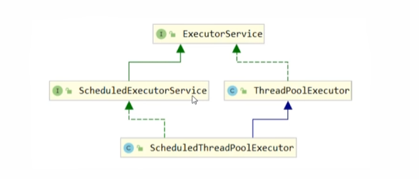
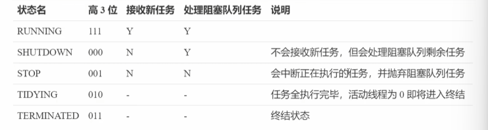
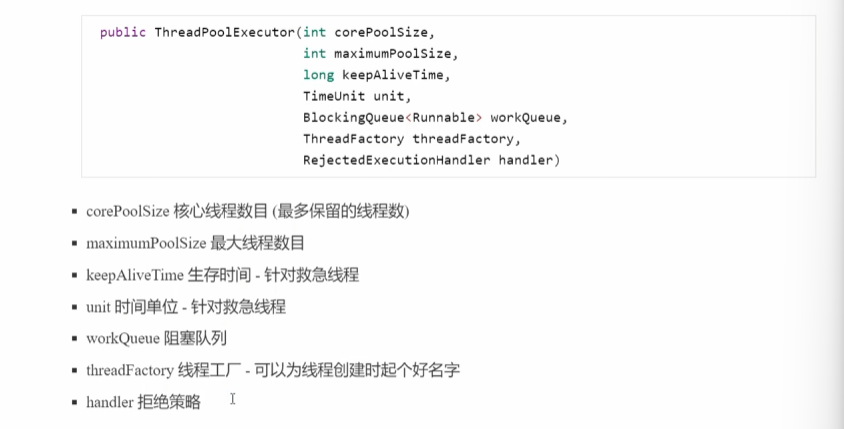
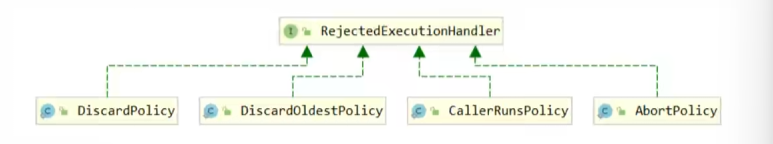

# 多线程并发编程笔记

## 线程池

### 基本概念

阻塞队列实现

```java
class BlockingQueue<T> {
    //任务队列
    private Deque<T> deque = new ArrayDeque<>();
    //锁：防止线程竞争获取线程
    ReentrantLock lock = new ReentrantLock();
    //生产者条件变量
    private Condition fullWaitSet = lock.newCondition();
    //消费者条件变量
    private Condition emptyWaitSet = lock.newCondition();
    //容量
    private int capacity;

    public T take() {
        lock.lock();
        try {
            while (deque.isEmpty()) {
                try {
                    emptyWaitSet.await();
                } catch (InterruptedException e) {
                    throw new RuntimeException(e);
                }
            }
            fullWaitSet.signal();
            return deque.removeFirst();
        } finally {
            lock.unlock();
        }
    }

    public void put(T t) {
        lock.lock();
        try {
            while (capacity == deque.size()) {
                try {
                    fullWaitSet.await();
                } catch (InterruptedException e) {
                    throw new RuntimeException(e);
                }
            }
            deque.addLast(t);
            emptyWaitSet.signal();
        } finally {
            lock.unlock();
        }
    }

    public int size() {
        lock.lock();
        try {
            return deque.size();
        } finally {
            lock.unlock();
        }
    }
}
```


线程池继承图




线程池状态

ThreadPoolExecutor使用int的高三位表示线程池状态，低29为表示线程数量



这是因为需要保证状态的原子性，组合起来可以用一次cas操作完成


ThreadPoolExecutor构造方法




拒绝策略：

1.AbortPolicy：抛出异常

2.CallerRunsPolicy：让调用者运行任务

3.DiscardPolicy：放弃本次任务

4.DiscardOldestPolicy：放弃队列中最早的任务，用该任务代替

5.Dubbo：对于AbortPolicy增强，会记录日志

6.Netty：创建一个新的线程执行任务

7.ActiveMQ：等待超时（60s），如果有空位就放入

8.PinPoint：使用拒绝策略链，一次尝试每一种拒绝策略




Executor中一些线程池的实现，实际开发中不建议使用这些

**固定大小线程池**

newFixedThreadPool：核心线程数=最大线程数，阻塞队列是无界的

```java
@Slf4j
public class Main {
    public static void main(String[] args) {
        ExecutorService pool = Executors.newFixedThreadPool(10);

        for (int i = 0; i < 10; i++) {
            int finalI = i;
            pool.execute(() -> log.info(String.valueOf(finalI)));
        }
    }
}
```

```java
@Slf4j
public class Main {
    public static void main(String[] args) {
        ExecutorService pool = Executors.newFixedThreadPool(10, new ThreadFactory() {
            private AtomicInteger threadNumber = new AtomicInteger(1);
            @Override
            public Thread newThread(Runnable r) {
                return new Thread(r, "pool-" + threadNumber.getAndIncrement());
            }
        });

        for (int i = 0; i < 10; i++) {
            int finalI = i;
            pool.execute(() -> log.info(String.valueOf(finalI)));
        }
    }
}
```


**带缓冲的线程池**

newCachedThreadPool：核心线程为0，创建的都是救急线程，空闲60s后被回收，救急线程可无限创建没有上限，SynchronousQueue没有容量，没有线程放不进去

适合任务数比较密集，但每个任务执行时间较短


**单线程线程池**

newSingleThreadExecutor：线程数固定为1，任务多余1的时候放入无界队列排队，任务执行完毕，唯一的线程也不会释放

自己创建一个线程串行执行任务，如果执行失败，线程就会被结束，队列中的其他任务就没法执行，这就是单线程线程池的功能，保证线程正常工作


### 线程池方法

execute：执行方法，传入Runnable接口实现类

```java
pool.execute(() -> log.info(String.valueOf(finalI)));
```


submit：执行方法，返回一个泛型结果，传入Callable接口实现类

实现有返回结果的线程运行用

```java
@Slf4j
public class Main {
    public static void main(String[] args) throws Exception {
        ExecutorService pool = Executors.newFixedThreadPool(10, new ThreadFactory() {
            private AtomicInteger threadNumber = new AtomicInteger(1);
            @Override
            public Thread newThread(Runnable r) {
                return new Thread(r, "pool-" + threadNumber.getAndIncrement());
            }
        });

        Future<String> future = pool.submit(new Callable<String>() {
            @Override
            public String call() throws Exception {
                Thread.sleep(1000);
                log.info("返回String");
                return "String";
            }
        });
        String s = future.get();
        log.info("s: " + s);
    }
}
```


invokeAll：提交tasks中的所有任务

```java
@Slf4j
public class Main {
    public static void main(String[] args) throws Exception {
        ExecutorService pool = Executors.newFixedThreadPool(10);
        List<Future<String>> futures = pool.invokeAll(
                Arrays.asList(
                        () -> {
                            log.info("return 1");
                            Thread.sleep(1000);
                            return "1";
                        },
                        () -> {
                            log.info("return 2");
                            Thread.sleep(2000);
                            return "2";
                        },
                        () -> {
                            log.info("return 3");
                            Thread.sleep(1400);
                            return "3";
                        }
                )
        );
        futures.forEach(future -> {
            try {
                log.info(future.get());
            } catch (InterruptedException | ExecutionException e) {
                throw new RuntimeException(e);
            }
        });
    }
}
```


invokeAny：不会执行全部任务，执行完其中的一个任务就将其返回，结束其他任务

```java
@Slf4j
public class Main {
    public static void main(String[] args) throws Exception {
        ExecutorService pool = Executors.newFixedThreadPool(10);
        String str = pool.invokeAny(
                Arrays.asList(
                        () -> {
                            log.info("return 1");
                            Thread.sleep(1000);
                            log.info("end 1");
                            return "1";
                        },
                        () -> {
                            log.info("return 2");
                            Thread.sleep(2000);
                            log.info("end 2");
                            return "2";
                        },
                        () -> {
                            log.info("return 3");
                            Thread.sleep(1400);
                            log.info("end 3");
                            return "3";
                        }
                )
        );
        log.info("{}", str);
    }
}
```

```java
16:58:53.702 [pool-1-thread-3] INFO com.pool.Main -- return 3
16:58:53.702 [pool-1-thread-2] INFO com.pool.Main -- return 2
16:58:53.702 [pool-1-thread-1] INFO com.pool.Main -- return 1
16:58:54.717 [pool-1-thread-1] INFO com.pool.Main -- end 1
16:58:54.717 [main] INFO com.pool.Main -- 1
```


shutdown：将线程池的状态变为SHUTDOWN（不会阻塞）

这里如果需要等待执行完（阻塞）需要使用awaitTermination方法

不会接受新的任务，会执行已提交任务，不会阻塞线程的执行

```java
@Slf4j
public class Main {
    public static void main(String[] args) throws Exception {
        ExecutorService pool = Executors.newFixedThreadPool(10);
        for (int i = 0; i < 10; i++) {
            int num = i;
            pool.execute(() -> {
                log.info(num + ":start");
                try {
                    Thread.sleep(1000 * num);
                } catch (InterruptedException e) {
                    throw new RuntimeException(e);
                }
                log.info(num + ":end");
            });
        }
        Thread.sleep(1000 * 5);
        pool.shutdown();
//        pool.shutdownNow();
    }
}
```

shutdownNow会立即停止没有执行完的线程


### 工作线程

让有限的工作线程来异步轮流处理无限多的任务，可以将其归类为分工模式，他的典型实现就是线程池，也体现了经典设计模式的享元模式

不同的任务类型应该使用不同的线程池，这样就可以避免饥饿，并提升效率

**饥饿**

固定大小线程池会有饥饿现象，例如我们现在对于每个任务需要有两步处理，我们的线程都去执行第一步，而第二步没有空闲线程执行，这种情况就会出现饥饿现象（第二步永远不会被执行）

以下是一个点饭-做菜的场景，两个员工都跑去点餐了，没人做饭都在等待餐品，发生饥饿

```java
@Slf4j
public class Main {
    public static void main(String[] args) throws Exception {
        ExecutorService pool = Executors.newFixedThreadPool(2);
        pool.execute(() -> {
           log.info("点餐");
           Future<String> future = pool.submit(() -> {
               log.info("做饭");
               return "饭";
           });
            try {
                log.info("上菜：" + future.get());
            } catch (InterruptedException | ExecutionException e) {
                throw new RuntimeException(e);
            }
        });
        pool.execute(() -> {
            log.info("点餐");
            Future<String> future = pool.submit(() -> {
                log.info("做饭");
                return "饭";
            });
            try {
                log.info("上菜：" + future.get());
            } catch (InterruptedException | ExecutionException e) {
                throw new RuntimeException(e);
            }
        });

    }
}
```

```
17:29:45.251 [pool-1-thread-2] INFO com.pool.Main -- 点餐
17:29:45.251 [pool-1-thread-1] INFO com.pool.Main -- 点餐
```


**饥饿解决**

分工，不同的员工分类处理不同的任务，而单独增加数量是不能治本的

```java
@Slf4j
public class Main {
    public static void main(String[] args) throws Exception {
        ExecutorService pool = Executors.newFixedThreadPool(2);
        ExecutorService Cooker = Executors.newFixedThreadPool(2);
        pool.execute(() -> {
           log.info("点餐");
           Future<String> future = Cooker.submit(() -> {
               log.info("做饭");
               return "饭";
           });
            try {
                log.info("上菜：" + future.get());
            } catch (InterruptedException | ExecutionException e) {
                throw new RuntimeException(e);
            }
        });
        pool.execute(() -> {
            log.info("点餐");
            Future<String> future = Cooker.submit(() -> {
                log.info("做饭");
                return "饭";
            });
            try {
                log.info("上菜：" + future.get());
            } catch (InterruptedException | ExecutionException e) {
                throw new RuntimeException(e);
            }
        });

    }
}
```


### 参数设置

过小的线程池不能充分的利用系统资源，容易导致饥饿

过大导致更多线程的上下文切换，占用更多的内存


CPU密集型：线程数=CPU核数+1（1保证操作系统的故障时线程顶上保证CPU不被浪费）

IO密集型：Web应用程序，当执行业务计算的时候，这个时候使用到CPU，当执行I/O操作的时候CPU就闲置下来了，可以利用多线程提高CPU利用率

线程数=CPU核数 * 期望利用率 * 总时间（CPU计算时间+等待时间）/ CPU计算时间

```
4核CPU计算时间是50%，期望CPU100利用
4 * 100% * 100% / 50% = 8
4核CPU计算时间是10%，期望CPU100利用
4 * 100% * 100% / 10% = 40
```


### 延时执行

Timer可以实现延时功能，Timer简单易用，但是所有任务都是同一个任务调度执行，所以任务都是串行的，如果一个任务延时后面的都会延时，发生异常后续任务也会被终止

```java
@Slf4j
public class Main {
    public static void main(String[] args) {
        TimerTask task1 = new TimerTask() {
            public void run() {
                log.info("task 1");
                int i = 1 / 0;
            }
        };
        TimerTask task2 = new TimerTask() {
            public void run() {
                log.info("task 2");
            }
        };
        Timer timer = new Timer();
        timer.schedule(task1, 1000);
        timer.schedule(task2, 1000);
    }
}
```

```
21:22:52.096 [Timer-0] INFO com.time.Main -- task 1
Exception in thread "Timer-0" java.lang.ArithmeticException: / by zero
	at com.time.Main$1.run(Main.java:14)
	at java.base/java.util.TimerThread.mainLoop(Timer.java:566)
	at java.base/java.util.TimerThread.run(Timer.java:516)
```


ScheduledThreadPoolExecutor

```java
@Slf4j
public class Main {
    public static void main(String[] args) {
        ScheduledExecutorService pool = Executors.newScheduledThreadPool(2);
        pool.schedule(() -> {log.info("Hello_1");}, 5, TimeUnit.SECONDS);
        pool.schedule(() -> {log.info("Hello_5");}, 1, TimeUnit.SECONDS);
    }
}
```

定时执行任务scheduleAtFixedRate

第三位是间隔的时间

```java
@Slf4j
public class Main {
    public static void main(String[] args) {
        ScheduledExecutorService pool = Executors.newScheduledThreadPool(2);
        pool.scheduleAtFixedRate(() -> {log.info("Hello_3");}, 1, 3, TimeUnit.SECONDS);
        pool.scheduleAtFixedRate(() -> {log.info("Hello_5");}, 1, 5, TimeUnit.SECONDS);
    }
}
```

scheduWithFixedDelay是从任务结束开始计时

- `scheduleAtFixedRate`：以固定的时间间隔（period）执行任务。如果任务执行时间小于period，则下一个任务在上一个任务完成后立即开始；如果任务执行时间大于period，则下一个任务会在上一个任务完成后立即开始，不会等待period。
- `scheduleWithFixedDelay`：在上一个任务完成后，等待固定的延迟时间（delay）再执行下一个任务。无论上一个任务的执行时间如何，都会在完成后等待delay再开始下一个任务。


#### 异常处理

第一种解决：手动catch打印日志

```java
ScheduledExecutorService pool = Executors.newScheduledThreadPool(2);
        pool.scheduleAtFixedRate(() -> {
            try {
                log.info("Hello_3");
                int i = 1 / 0;
            } catch (Exception e) {
                log.error("1/2=0");
            }
        }, 1, 3, TimeUnit.SECONDS);
```

第二种：借助Future对象，调用get时触发异常

```java
@Slf4j
public class Main {
    public static void main(String[] args) throws ExecutionException, InterruptedException {
        ExecutorService pool = Executors.newFixedThreadPool(1);
        Future<Boolean> submit = pool.submit(() -> {
            log.info("task1");
            int i = 1 / 0;
            return true;
        });
        Boolean b = submit.get();
    }
}
```


#### 定时任务

```java
@Slf4j
public class Main {
    public static void main(String[] args) throws ExecutionException, InterruptedException {
        //当前时间和周四时间差
        long period = 1000 * 60 * 60 * 24;
        LocalDateTime now = LocalDateTime.now();
        LocalDateTime time = now.withHour(10).withMinute(0).withSecond(0).withNano(0).with(DayOfWeek.TUESDAY);

        long initailDelay = Duration.between(now, time).toMillis();
        ScheduledExecutorService pool = Executors.newScheduledThreadPool(1);
        pool.scheduleAtFixedRate(() -> {

        }, initailDelay, period, TimeUnit.MILLISECONDS);

    }
}
```


### Fork/Join

体现的是分治思想，将任务拆分，将计算的结果合并

例如递归，分支之类的我们用Fork加入多线程，将小任务使用不同线程完成，进一步提升计算效率

Fork/Join默认创建与cpu核心数大小相同的线程池

```java
public class Main {
    public static void main(String[] args) {
        ForkJoinPool pool = new ForkJoinPool(4);
        System.out.println(pool.invoke(new TaskReturn(5)));
    }
}

class TaskReturn extends RecursiveTask<Integer> {
    private int n;
    public TaskReturn(int n) {
        this.n = n;
    }
    @Override
    protected Integer compute() {
        if(n == 1) {
            return 1;
        }
        //创建下一个任务
        TaskReturn taskReturn = new TaskReturn(n - 1);
        //执行任务
        taskReturn.fork();
        //得到的结果加上当前的n
        return taskReturn.join() + n;
    }
}
```

或者二分

```java
@Slf4j
class TaskReturn extends RecursiveTask<Integer> {
    private int begin;
    private int end;

    public TaskReturn(int begin, int end) {
        this.begin = begin;
        this.end = end;
    }

    @Override
    protected Integer compute() {
        if (begin > end) {
            return 0;
        }
        if (begin == end) {
            return begin;
        }
        int mid = (begin + end) / 2;
        TaskReturn taskReturn1 = new TaskReturn(begin,  mid);
        TaskReturn taskReturn2 = new TaskReturn(mid + 1,  end);
        taskReturn1.fork();
        taskReturn2.fork();
        return taskReturn1.join() + taskReturn2.join();
    }
}
```


无结果的情况：使用RecursiveAction

```java
public class Main {
    public static void main(String[] args) {
        ForkJoinPool pool = new ForkJoinPool(3);
        pool.invoke(new Task(5));
    }
}

@Slf4j
class Task extends RecursiveAction {
    int value;

    public Task(int value) {
        this.value = value;
    }

    @Override
    protected void compute() {
        if (value <= 0) {
            return;
        }
        Task next = new Task(value - 1);
        next.fork();
        log.info(value + "");
        next.join();
    }
}
```

```
17:04:54.357 [ForkJoinPool-1-worker-1] INFO com.fork.Task -- 5
17:04:54.357 [ForkJoinPool-1-worker-2] INFO com.fork.Task -- 4
17:04:54.357 [ForkJoinPool-1-worker-3] INFO com.fork.Task -- 3
17:04:54.362 [ForkJoinPool-1-worker-2] INFO com.fork.Task -- 1
17:04:54.362 [ForkJoinPool-1-worker-1] INFO com.fork.Task -- 2
```

