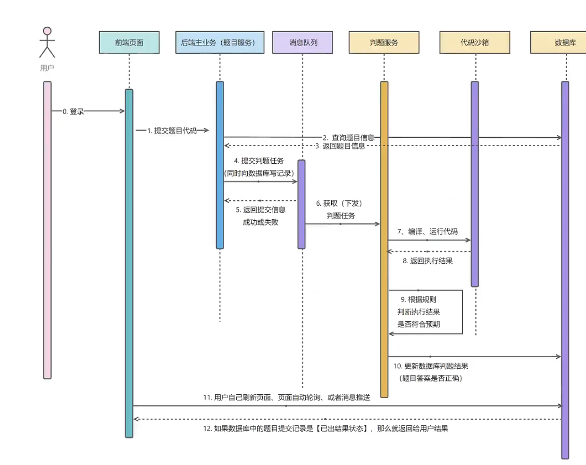

# 微服务OJ在线判题

OJ常见概念：题目内存时间限制，题目描述，题目输入，题目输出，输入用例，测试用例

判题过程异步，提交之后，生成提交记录，有运行的结果

目的：用于在线评测编程题目代码的系统，能够根据用户提交代码，出题人预先设置的题目输入输出用例，编译代码，运行代码，判断代码运行结果是否正确

判题系统作为API开放，便于开发者制作自己的系统

功能：

题目模块：创建、删除、修改题目，搜索用户，在线做题，提交代码模块

用户模块：登陆注册

判题模块：提交判题、错误处理、自主实现代码沙箱、开放接口

在线做题：在线提交


拓展思路：支持多种语言、Remote Judge、普通评测、特殊评测、交互评测、在线自测

统计分析用户记录、权限校验、子任务分组评测、文件IO


## 层级划分

用户层：PC端网页

接入层：Nginx、API网关、负载均衡

业务层：项目模块、判题模块、用户模块

服务层：判题服务（代码沙箱） 用户鉴权服务、配置服务、通知服务

存储层：MySQL、Redis、RabbitMQ

资源层：Linux、Docker、K8S


## 后端模板

aop：用于全局权限校验，全局日志记录

common：万用的类，比如通用响应

config：用于接收application.yaml中的参数，初始化一些客户端的配置

constant：定义常量

job：任务相关、定时任务、单次任务

manager：服务层，包括 判题服务（代码沙箱） 用户鉴权服务、配置服务、通知服务


## 数据库表

题目表

题目标题

内容

标签

答案

提交数

通过数

judgeConfig ：存储判题配置

judgeCase ：judgeCase判题用例

```mysql
CREATE TABLE `my_db`.`question` (
  `id` int NOT NULL AUTO_INCREMENT COMMENT '主键ID',
  `title` varchar(255) NOT NULL COMMENT '问题标题',
  `content` text NOT NULL COMMENT '问题内容',
  `tags` varchar(200) DEFAULT NULL COMMENT '标签列表，JSON格式',
  `answer` text DEFAULT NULL COMMENT '参考答案',
  `submit_count` int DEFAULT 0 COMMENT '提交次数',
  `accepted_count` int DEFAULT 0 COMMENT '通过次数',
  `judge_case` text DEFAULT NULL COMMENT '判题用例(JSON数组)',
  `judge_config` text DEFAULT NULL COMMENT '判题配置(JSON对象)',
  `user_id` int NOT NULL COMMENT '创建用户ID',
  `create_time` datetime NOT NULL DEFAULT CURRENT_TIMESTAMP COMMENT '创建时间',
  `update_time` datetime NOT NULL DEFAULT CURRENT_TIMESTAMP ON UPDATE CURRENT_TIMESTAMP COMMENT '更新时间',
  `is_delete` tinyint DEFAULT 0 COMMENT '逻辑删除标记(0-未删除,1-已删除)',
  PRIMARY KEY (`id`),
  KEY `idx_user_id` (`user_id`),
  KEY `idx_create_time` (`create_time`)
) ENGINE=InnoDB DEFAULT CHARSET=utf8mb4 COLLATE=utf8mb4_0900_ai_ci COMMENT='问题表';

```


题目提交表

提交用户id

题目id

提交语言

用户提交代码

判题状态：判题中、带判题、成功、失败

判题信息：判题过程中得到的一些信息，例如程序失败的原因、程序执行消耗的空间、时间

判题信息枚举值：Accept 成功、Wrong Answer 答案错误、Compile Error编译错误、Memory Limit 空间不足、Time Out 超时、Waitting 等待中、Runtime Error 运行错误、System Error 系统错误

```mysql
CREATE TABLE `my_db`.`submission` (
  `id` bigint NOT NULL AUTO_INCREMENT COMMENT '提交ID',
  `question_id` bigint NOT NULL COMMENT '关联的题目ID',
  `user_id` bigint NOT NULL COMMENT '提交用户ID',
  `language` varchar(20) NOT NULL COMMENT '编程语言(java/python/cpp...)',
  `code` text NOT NULL COMMENT '提交的代码',
  `status` varchar(30) NOT NULL DEFAULT 'waiting' COMMENT '判题状态(waiting/running/success/failed)',
  `judge_info` json DEFAULT NULL COMMENT '判题信息(JSON格式)',
  `create_time` datetime NOT NULL DEFAULT CURRENT_TIMESTAMP COMMENT '提交时间',
  `update_time` datetime NOT NULL DEFAULT CURRENT_TIMESTAMP ON UPDATE CURRENT_TIMESTAMP COMMENT '更新时间',
  `is_delete` tinyint NOT NULL DEFAULT 0 COMMENT '逻辑删除(0-正常,1-删除)',
  PRIMARY KEY (`id`),
  KEY `idx_question_id` (`question_id`),
  KEY `idx_user_id` (`user_id`),
  KEY `idx_create_time` (`create_time`)
) ENGINE=InnoDB DEFAULT CHARSET=utf8mb4 COLLATE=utf8mb4_0900_ai_ci COMMENT='用户题目提交记录表';
```

后端开发流程

1.根据功能设计表

2.自动生成对数据库的基本增删改查

3.编写Controller层，实现基本的增删改查和权限校验

4.去根据业务定制开发新的功能/编写新的代码


为了方便的处理json字段的某个对象，需要给对应的json字段配置独立的类

之所以这样是因为要方便前端进行数据的格式化，而不是整一个json字符串

分类VO DTO TO

基础的增删改查略


## 判题机




### 判题模块

调用代码沙箱，把代码和输入交给沙箱处理

代码沙箱：只负责接受代码和输入，返回编译运行的结果，不负责判题（可以作为独立的项目/服务，提供给其他的代码使用）

代码沙箱接受一组运行用例

如果是每个用例单独调用一次代码沙箱，会调用多次接口，需要多次网络传输、程序多次编译，记录程序状态


### 代码沙箱

定义代码沙箱接口，提高通用性

之后我们的项目只调用接口，不调用具体的实现类

```java
/**
 * 执行代码，获取编译运行结果
 */
public interface CodeSandBox {
    ExecuteCodeResponse executeCode(ExecuteCodeRequest executeCodeRequest);
}
```

分为了实例实现、第三方沙箱、自主实现沙箱

```java
@Test
void contextLoads() {
    String code = "int main() { }";
    String language = "Java";
    List<String> inputList = Arrays.asList("1 2", "3 4");

    CodeSandBox sandbox = new ExampleCodeSandBox();
    ExecuteCodeRequest request = ExecuteCodeRequest.builder().
            code(code).
            language(language).
            inputList(inputList).
            build();
    ExecuteCodeResponse executeCodeResponse = sandbox.executeCode(request);
    System.out.println(executeCodeResponse);
}
```

还可以通过工厂模式进行对于new的替换，可以灵活调用传入参数进行使用不同的沙箱实现

```java
public class CodeSandBoxFactory {
    public CodeSandBox newInstance (String codeSandBoxName) {
        switch (codeSandBoxName) {
            case "example":
                return new ExampleCodeSandBox();
            case "remote":
                return new RemoteCodeSandBox();
            case "third":
                return new ThirdPartyCodeSandBox();
            default:
                return null;
        }
    }
}
```

```java
@Test
void contextLoads() {
    String code = "int main() { }";
    String language = "Java";
    List<String> inputList = Arrays.asList("1 2", "3 4");

    CodeSandBox sandbox = new CodeSandBoxFactory().newInstance("example");
    ExecuteCodeRequest request = ExecuteCodeRequest.builder().
            code(code).
            language(language).
            inputList(inputList).
            build();
    ExecuteCodeResponse executeCodeResponse = sandbox.executeCode(request);
    System.out.println(executeCodeResponse);
}
```

参数配置化，将一些可选项交给用户自定义在配置文件中修改

配置在application中，通过Value注解取出类型


### 沙箱日志管理

通过静态代理实现，增添能力

```java
@Slf4j
@AllArgsConstructor
public class CodeSandBoxProxy implements CodeSandBox {
    private CodeSandBox codeSandBox;

    @Override
    public ExecuteCodeResponse executeCode(ExecuteCodeRequest executeCodeRequest) {
        log.info("代码沙箱日志记录：----");
        ExecuteCodeResponse executeCodeResponse = codeSandBox.executeCode(executeCodeRequest);
        log.info("代码返回结果记录：----");
        return executeCodeResponse;
    }
}
```

用代理类进行调用

```java
public static void main(String[] args) {
    String code = "int main() { }";
    String language = "Java";
    List<String> inputList = Arrays.asList("1 2", "3 4");

    CodeSandBox sandbox = new CodeSandBoxFactory().newInstance("example");
    ExecuteCodeRequest request = ExecuteCodeRequest.builder().
            code(code).
            language(language).
            inputList(inputList).
            build();
    CodeSandBoxProxy proxy = new CodeSandBoxProxy(sandbox);
    ExecuteCodeResponse executeCodeResponse = proxy.executeCode(request);
    System.out.println(executeCodeResponse);
}
```


### 判题服务

1.获取题目提交Id，获取到对应的题目，提交信息

2.更改题目状态，改为已提交

3.异步使用判断逻辑，调用沙箱，获取执行结果，之后根据沙箱的执行结果，设置题目的判题状态和信息

4.异步操作的时候，直接返回题目Id


### 判断逻辑

1.判断沙箱执行结果输出数量是否和预期输出数量相等（outlist.size() == inputlist.size()）

2.依次每一项输出和预期输出是否相等

3.判题题目的限制是否符合要求

4.如果有异常情况进行额外处理


思考：如果我的盘体策略可能会有很多种，比如：我们的代码沙箱本身执行程序需要消耗时间，这个时间可能不同的编程语言是不同的，例如沙箱执行Java代码需要额外花10s，可以通过策略模式进行优化

我们对于不同的语言有不同的可定制化的判题策略，定义JudgeManager通过接口进行策略的使用，而策略的选择放在JudgeManager中传入language进行if-else的策略实现类的建立


## 代码沙箱

只负责接受代码和输入，返回编译运行的结果，不负责判题

### 原生实现

不借助第三方库，用最干净的方式实现代码沙箱

代码沙箱需要：接受代码->编译代码javac->执行代码java

一段代码示例，将其放在resource目录下

统一类名，对于用户代码有要求，限制类名为Main，且不用从用户代码中提取类名

```java
public class Main {
    public static void main(String[] args) {
        int a = Integer.parseInt(args[0]);
        int b = Integer.parseInt(args[1]);
        System.out.println("结果是：" + (a + b));
    }
}
```

通过javac进行编译，java运行来执行

```
javac -encoding UTF-8 Main.java
java Main 4 6
```

打印出结果

```
结果是：10
```


### 核心流程

核心实现思路：用程序代替人工，用程序执行命令，编译执行代码

Java进程执行管理类：Process

1.保存用户代码为文件

2.编译代码得到class文件

3.执行代码，得到输出结果

4.收集整理输出结果

5.文件清理

6.错误处理，提升程序健壮性


新建目录：将用户代码放到一个独立的文件夹中

完成一个执行进程的工具类

```java
package com.sandbox.utils;

import com.sandbox.model.ExecuteMessage;

import java.io.BufferedReader;
import java.io.IOException;
import java.io.InputStreamReader;

/**
 * 进程工具类
 */
public class ProcessUtils {
    public static ExecuteMessage runProcess(String command) throws InterruptedException, IOException {
        Process process = Runtime.getRuntime().exec(command);
        StringBuilder message = new StringBuilder();
        StringBuilder error = new StringBuilder();
        int exitCode = process.waitFor();
        if (exitCode == 0) {
            System.out.println("Success...");
            BufferedReader reader = new BufferedReader(new InputStreamReader(process.getInputStream()));
            String compileMessage;
            while((compileMessage = reader.readLine()) != null) {
                message.append(compileMessage);
            }
            System.out.println(message);
        } else {
            System.out.println("Fail!! " + "exitCode:" + exitCode);
            BufferedReader reader = new BufferedReader(new InputStreamReader(process.getErrorStream()));
            String compileMessage;
            while((compileMessage = reader.readLine()) != null) {
                error.append(compileMessage);
            }
            System.out.println(error);
        }
        ExecuteMessage executeMessage = new ExecuteMessage();
        executeMessage.setExitCode(exitCode);
        executeMessage.setMessage(message.toString());
        executeMessage.setErrorMessage(error.toString());
        return executeMessage;
    }
}
```

```java
package com.sandbox.service;

import cn.hutool.core.io.FileUtil;
import com.sandbox.model.ExecuteCodeRequest;
import com.sandbox.model.ExecuteCodeResponse;
import com.sandbox.model.ExecuteMessage;
import com.sandbox.utils.ProcessUtils;

import java.io.*;
import java.util.*;
import java.util.stream.Collectors;

public class JavaNativeCodeSandBox implements CodeSandBox {
    private static final String GLOBAL_CODE_DIR_NAME = "tmpCode";
    private static final String GLOBAL_JAVA_CLASS_NAME = "Main.java";

    @Override
    public ExecuteCodeResponse execute(ExecuteCodeRequest request) {
        List<String> inputList = request.getInputList();
        String code = request.getCode();
        String language = request.getLanguage();
        String userDir = System.getProperty("user.dir");
        String globalCodePath = userDir + File.separator + GLOBAL_CODE_DIR_NAME;
        System.out.println(globalCodePath);
        if (!FileUtil.exist(globalCodePath)) {
            FileUtil.mkdir(globalCodePath);
        }
        //把用户的代码分级隔离存放
        String userCodeParentPath = globalCodePath + File.separator + UUID.randomUUID();
        String userCodePath = userCodeParentPath + File.separator + GLOBAL_JAVA_CLASS_NAME;
        System.out.println(userCodePath);
        File userCodeFile = FileUtil.writeString(code, userCodePath, "UTF-8");

        String compileCmd = String.format("javac -encoding UTF-8 %s", userCodeFile.getAbsoluteFile());
        ExecuteMessage executeCompileMessage;
        try {
            executeCompileMessage = ProcessUtils.runProcess(compileCmd);
        } catch (IOException | InterruptedException e) {
            throw new RuntimeException(e);
        }
        //运行指令执行
        List<String> result = new ArrayList<>();
        for(String input: inputList) {
            String runCmd = String.format("java -Dfile.encoding=UTF-8 -cp %s Main %s", userCodeParentPath, input);
            try {
                Process process = Runtime.getRuntime().exec(runCmd);
                int exitCode = process.waitFor();
                if (exitCode == 0) {
                    BufferedReader reader = new BufferedReader(new InputStreamReader(process.getInputStream()));
                    String line;
                    while ((line = reader.readLine()) != null) {
                        result.add(line);
                    }
                }
            } catch (InterruptedException | IOException e) {
                throw new RuntimeException(e);
            }
        }
//        for(String ans : result) {
//            System.out.println(ans);
//        }
        ExecuteCodeResponse response = new ExecuteCodeResponse();
//        response.setMessage("编译信息：" + executeCompileMessage.toString() + "\n运行信息： " +runExecuteMessage.toString());
        response.setOutputList(result);
        return response;
    }

    public static void main(String[] args) {
        JavaNativeCodeSandBox sandBox = new JavaNativeCodeSandBox();
        ExecuteCodeResponse response = sandBox.execute(ExecuteCodeRequest.builder().
                language("java").
                code("public class Main {\n" +
                        "    public static void main(String[] args) {\n" +
                        "        int a = Integer.parseInt(args[0]);\n" +
                        "        int b = Integer.parseInt(args[1]);\n" +
                        "        System.out.println(\"结果是：\" + (a + b));\n" +
                        "    }\n" +
                        "}").
                inputList(Arrays.asList("1 3", "5 7")).
                build());
        System.out.println(response);
    }
}
```

在结束后将生成的字节码文件和写入源文件删除

```java
if(userCodeFile.getParentFile() != null) {
    boolean del = FileUtil.del(userCodeParentPath);
    System.out.println("删除" + (del ? "成功" : "失败"));
}
```


### 安全风险

#### 用户提交恶意代码

1.时间：提交无限睡眠代码，例如sleep

2.空间：占用空间不释放，例如递归

JVisualVM可以连接到JVM虚拟机监控虚拟机

3.通过读取文件得到配置文件获取其中的配置信息

```java
import java.io.IOException;
import java.nio.file.Files;
import java.nio.file.Paths;
import java.util.List;

public class Main {
    public static void main(String[] args) throws IOException {
        String userDirectory = System.getProperty("user.dir");
        String filePath = userDirectory + "/src/main/resources/application.yaml";
        List<String> allLines = Files.readAllLines(Paths.get(filePath));
        for (String line : allLines) {
            System.out.println(line);
        }
    }
}
```

返回的结果中存在结果，加入敏感信息放在这里面就会有泄露风险

```
ExecuteCodeResponse(outputList=[spring:,   application:,     name: sandbox, server:,   port: 8080, spring:,   application:,     name: sandbox, server:,   port: 8080], message=null, status=0, judgeInfo=null)
```

4.将恶意程序写入服务器目录

之后将写入的程序通过服务器环境进行执行，这样就非常的危险了


5.执行高位命令

例如rm -rf /* 等


#### 解决方式

1.超时控制	2.限制给用户的资源	3.禁用用户的读写权限（黑白名单/文件、网络、执行）	4.对于整个环境进行隔离

超时控制：

```java
public class Main {
    public static void main(String[] args) throws InterruptedException {
        Thread.sleep(20000);
        System.out.println("睡眠完毕");
    }
}
```

```java
Process process = Runtime.getRuntime().exec(runCmd);
new Thread(() -> {
    try {
        Thread.sleep(5000);
        process.destroy();
    } catch (InterruptedException e) {
        throw new RuntimeException(e);
    }
}).start();
```


资源分配：

在启动Java的时候可以指定JVM参数 ：-Xmx256m

```java
import java.util.ArrayList;
import java.util.List;

public class Main {
    public static void main(String[] args) {
        List<byte[]> list = new ArrayList<byte[]>();
        while(true) {
            list.add(new byte[0]);
        }
    }
}
```

```java
String runCmd = String.format("java -Xmx256M -Dfile.encoding=UTF-8 -cp %s Main %s", userCodeParentPath, input);
```


#### 操作限制

运用字典树，对于代码中的读写，执行等关键词进行限制

Java安全管理器是Java提供保护JVM，java程序的


## Docker代码沙箱

Docker基本用法，命令行，Java客户端

Docker实现代码沙箱

提升Docker沙箱的安全性


实现原理：

1.Docker运行在Linux内核上

2.CGroups：实现了容器的资源隔离，底层是Linux CGroup，能够控制进程使用的资源

3.Network网络：实现容器的网络隔离，docker容器内部的网络互不影响

4.Namespaces命名空间：可以把进程隔离在不同的命名空间下，每个容器都有自己的命名空间，不同的命名空间下的进程互不影响

5.Storage存储空间：容器内的文件相互隔离
